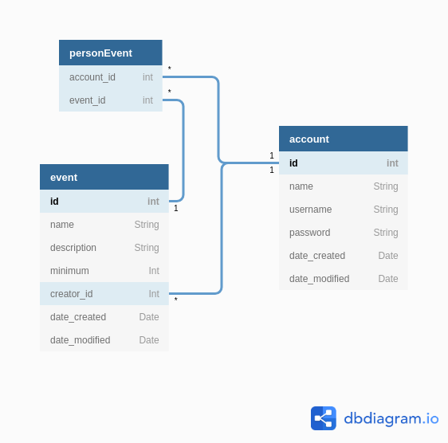

# [Tietokantasovellus: tapahtumatietokanta](https://lit-eventdb.herokuapp.com/)

Sovellus, johon voi lisätä tapahtumia, joihin henkilöt voivat sitten merkitä osallistuvansa/kiinnostuneisuutta. Niin käyttäjiä kuin tapahtumia voi muokata ja poistaa, ja tapahtumille on listauksia joilla niitä rajataan mm. suhteen kirjautuneeseen käyttäjään perusteella.

### [User storyt](dokumentaatio/userstories.md)

### [Puuttuvat toiminnallisuudet](dokumentaatio/puuttuvat.md)

### Tietokantakaavio

### [Tietokannan create table -lauseet](dokumentaatio/createlauseet.md)
